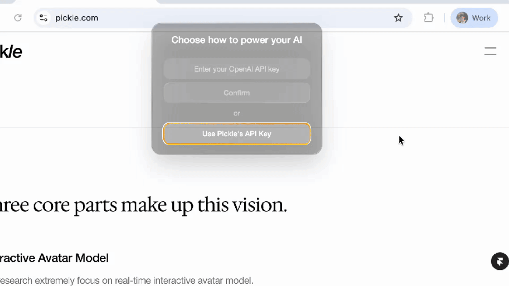

<p align="center">
  <a href="https://pickle.com/glass">
   
  </a>

  <h1 align="center">Glass by Pickle: Digital Mind Extension 🧠</h1>

</p>

<p align="center">
  <a href="https://x.com/intent/user?screen_name=leinadpark" style="text-decoration: none;">
    
  </a>
  <a href="https://pickle.com" style="text-decoration: none;">
    
  </a>
</p>

🤖 **Fast, light & open-source**—Glass lives on your desktop, sees what you see, listens in real time, understands your context, and turns every moment into structured knowledge.

💬 **Proactive in meetings**—it surfaces action items, summaries, and answers the instant you need them.

🫥️ **Truly invisible**—never shows up in screen recordings, screenshots, or your dock; no always-on capture or hidden sharing.

## Instant Launch

⚡️  Skip the setup—launch instantly with our ready-to-run macOS app.  [[Download Here]](https://www.dropbox.com/scl/fi/znid09apxiwtwvxer6oc9/Glass_latest.dmg?rlkey=gwvvyb3bizkl25frhs4k1zwds&st=37q31b4w&dl=1)

## Quick Start (Local Build)


  ```bash
  npm run setup
  ```


## Highlights


### Ask: get answers based on your all previous screen actions & audio


### Meetings: real-time meeting notes, live summary, session records


### Use your own OpenAI API key, or sign up to use ours (free)



You can visit [here](https://platform.openai.com/api-keys) to get your OpenAI API Key.

### Liquid glass design (coming soon)


## Keyboard Shortcuts

`Ctrl/Cmd + \` : show and hide main window

`Ctrl/Cmd + Enter` : ask AI using your all previous screen and audio

`Ctrl/Cmd + Arrows` : move main window position

## Contributing

We love contributions! Feel free to open issues for bugs or feature requests.

## About Pickle

Our mission is to build a living digital clone for everyone. Glass is Step 1—a trusted pipeline that turns your daily data into a scalable clone. Visit [pickle.com](https://pickle.com) to learn more (we're hiring!)