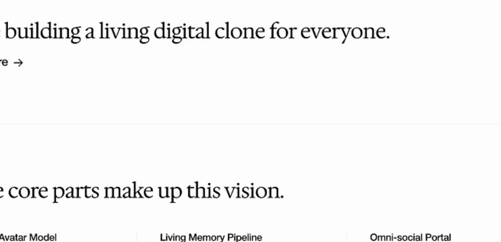

<p align="center">
  <a href="https://www.pickle.com/glass">
   
  </a>

  <h3 align="center">Glass by Pickle</h3>

  <p align="center">
    Invisible AI Desktop Asisstant.
    <br />
    <br />
    <a href="https://www.pickle.com/glass">Website</a>
    ·
    <a href="https://www.dropbox.com/scl/fi/znid09apxiwtwvxer6oc9/Glass_latest.dmg?rlkey=gwvvyb3bizkl25frhs4k1zwds&st=37q31b4w&dl=1">Direct Download for MacOS</a>
  </p>
</p>


## Installation


  ```bash
  npm run setup
  ```

- or [Direct download for Macos](https://www.dropbox.com/scl/fi/znid09apxiwtwvxer6oc9/Glass_latest.dmg?rlkey=gwvvyb3bizkl25frhs4k1zwds&st=37q31b4w&dl=1) (Public Beta)

## Highlights


#### Glass runs in background, sees your screen and listens to your audio.


- `Ctrl/Cmd + Enter` to Ask AI with your context anytime.
- `Listen` starts note taking and live summary.
- `Ctrl/Cmd + \` to hide, `Ctrl/Cmd + arrows` to move.

### True Glass Design (Coming Soon)


## Powering your AI

- You can choose either to use your own API key, or use Pickle's API Key for free in the onboarding.
- To use your own OpenAI API key, visit [here](https://platform.openai.com/api-keys) to get your key.


## About Pickle

We are Interactive Clone Company. Please visit [pickle.com](https://pickle.com) to learn more.